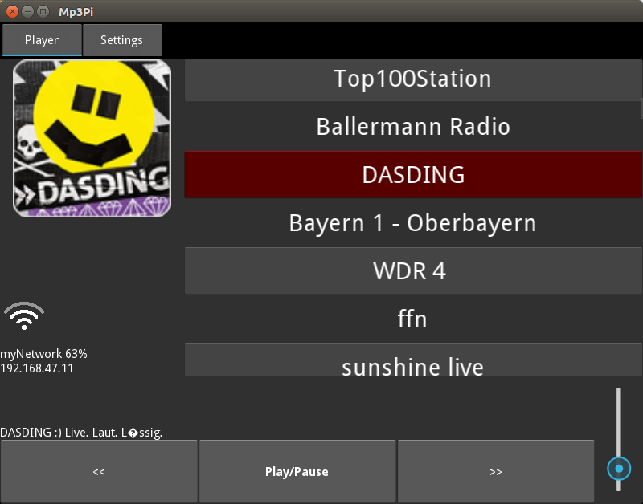

# mp3pi

Requirements on Ubuntu:

apt-get install mpg123 python-kivy libbluetooth-dev bc

pip install pyalsaaudio pybluez python-networkmanager pygments

Requirements on Raspberry Pi:

(from https://kivy.org/docs/installation/installation-rpi.html)

apt-get install libsdl2-dev libsdl2-image-dev libsdl2-mixer-dev libsdl2-ttf-dev \
   pkg-config libgl1-mesa-dev libgles2-mesa-dev \
   python-setuptools libgstreamer1.0-dev git-core \
   gstreamer1.0-plugins-{bad,base,good,ugly} \
   gstreamer1.0-{omx,alsa} python-dev cython

  apt-get install python-pip libjpeg-dev python-dbus pulseaudio-utils pulseaudio mtdev-tools

  pip install git+https://github.com/kivy/kivy.git@master

systemctl set-default multi-user.target

cp systemd/mp3pi.service /etc/systemd/system
systemctl enable mp3pi

https://github.com/graysky2/pulseaudio-ctl

?? gir1.2-networkmanager-1.0 gir1.2-nmgtk-1.0 libnm-dev libnm-glib-dev libnm-glib-vpn-dev libnm-gtk-dev
  libnm-util-dev libnmap-parser-perl libnmz7 libnmz7-dev network-manager-dev ??

Screen is turned upside down:
  add "lcd_rotate=2" to /boot/config.txt

Undervolt symbol in upper right is bugging you:
  add "avoid_warnings=1" to /boot/config.txt

Add Splash Screen:
  apt-get install plymouth
  plymouth-set-default-theme tribar

  Add "quiet splash" to the kernel cmdline /boot/cmdline.txt

